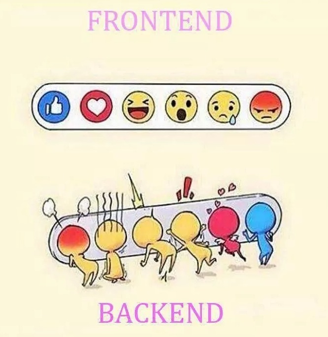
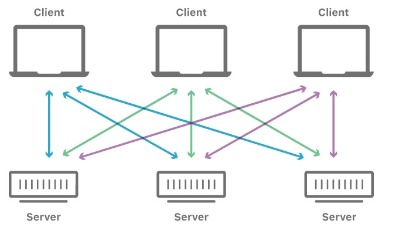
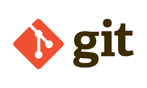
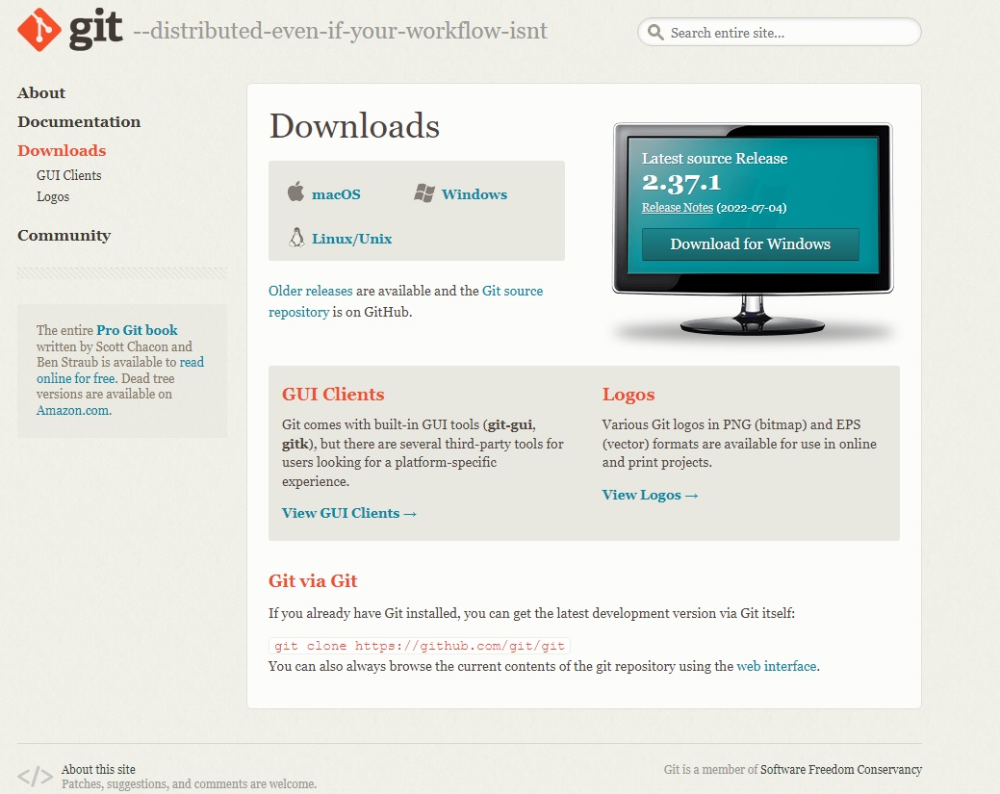
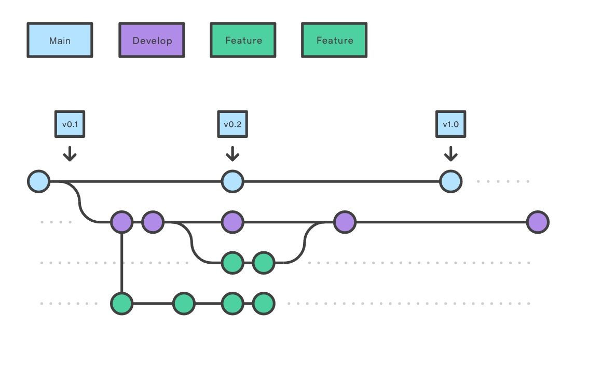

<h1 align="center">
  
</h1>

# Introdução - Conceitos Iniciais + Versionamento de Código

Turma Online 19 - Todas em Tech  | Back-end | Semana 1 | 2022 | Professora Louise Costa

### **Instruções**
Antes de começar, vamos organizar nosso setup.
* Use a reação do zoom para levantar a mão para qualquer dúvida
* Tem dúvida? Pergunte!
* Tá com vergonha de perguntar? Pergunte assim mesmo!
* Não se incomode em perguntar as monitoras pelo chat
* Se puder deixe a câmera ligada!
* Deixe apenas o necessário aberto no seu computador!
* Beba água e divirta-se. Não se apresse pequena padawan!

<h1 align="center">

</h1>

## Resumo
O que veremos na aula de hoje?
* [Conceitos básicos](#Conceitos-básicos)
* [Terminal & Versionamento de código](#Terminal-&-Versionamento-de-código)
* [Git & GitHub](#Git-&-GitHub)

## Conteúdo
### Conceitos básicos
1. [O que é programação](#O-que-é-programação)
2. [Backend, Frontend, Fullstack, Mobile](#Backend-Frontend-Fullstack-Mobile)
3. [Client-side e Server-side](#Client-side-e-Server-side)
4. [Algoritmo & Pseudocódigo](#Algoritmo-&-Pseudocódigo)
### Terminal & Versionamento de código
1. [Terminal](#Terminal)
2. [Versionamento de código](#Versionamento-de-código)
### Git & GitHub
2. [Git](#Git)
   * [Gitflow](#Gitflow)
   * [Comandos básicos](#Comandos-básicos)
2. [GitHub](#GitHub)
   * [Markdown](#Markdown)
   * [Commits semânticos](#commits-semânticos)

## Conceitos básicos 

## **O que é programação?**

A programação é um processo de escrita, testes e manutenção de programas de computadores. Esses programas, por sua vez, são compostos por conjuntos de instruções determinados pelo programador que descrevem tarefas a serem realizadas pela máquina e atendem diversas finalidades.

Afinal de contas o computador é uma máquina inteligentemente burra!

O início da programação está diretamente ligado à história dos computadores. A primeira programadora foi uma mulher chamada Ada Lovelace, que escreveu um código para possibilitar a utilização da máquina analítica de Charles Babbage, uma máquina robusta, de difícil comunicação, considerada a precursora dos computadores eletrônicos atuais.

Quando paramos para analisar, os computadores não são de fato inteligentes, eles apenas executam processos com uma velocidade extremamente maior do que a nossa. Por isso, precisamos definir regras bem detalhadas e instruí-los cuidadosamente para que realizem algum trabalho, que pode ser calcular números como em uma calculadora ou simplesmente exibir um nome na tela.

Mas, para compreender de verdade do que ela se trata, é importante conhecer dois elementos fundamentais que compõem todos os computadores modernos, que são o hardware e o software.

Um computador é formado por componentes físicos, como a parte externa do seu celular, a CPU de um PC, a memória, o mouse, enfim… os meios pelos quais os sinais elétricos podem ser convertidos em dados, informações.

Esses componentes são chamados de hardware e a sua linguagem binária, que é a linguagem de máquina, é composta apenas por bits, que são zeros e uns. Os bits representam a ausência ou presença de sinais elétricos. Agora, imagina utilizar o seu celular tendo que interpretar informações binárias: se tudo o que você visse na tela fosse uma sequência infinita de zeros e uns, os celulares não seriam nada práticos, não é mesmo? É por causa disso que existem os softwares.

O software é o meio pelo qual a linguagem de máquina pode ser compilada ou interpretada, através de códigos criados em uma linguagem intermediária, para idiomas que conhecemos, como o português, o inglês e também para imagens, cores, números… enfim, uma série de dados que podem ser assimilados mais facilmente pelos seres humanos. Alguns exemplos de softwares são os programas de computadores, como o Word, Excel e Paint, e as aplicações para celulares, como a Playstore, App Store ou o Uber. Os sistemas operacionais, como o Android, Windows, Linux ou o Mac, também podem ser vistos, de forma simplificada, como softwares gigantes que comportam outros softwares.

Mas, afinal, qual é a relação entre hardware, software e programação? A programação é exatamente quem possibilita a existência dos softwares e, por consequência, a utilização mais prática dos hardwares. Para poder dar origem aos softwares, a programação ganha uma linguagem própria que compõe códigos escritos por programadores.

*Qual a importância da programação?*

Como já falamos, desde os primórdios, a programação tinha um objetivo de trazer maior comodidade à vida humana com automação. O foco era tornar as tarefas mais simples e menos demoradas.

Isso ocorre por conta da programação. A ciência de dar instruções aos computadores permitiu criar sistemas processadores que automatizam a escrita e a simplificam.

Essa linguagem nada mais é do que um método padronizado que permite comunicar instruções específicas para um computador. Há centenas de variações e todas elas permitem que o programador defina sobre quais dados o computador deverá atuar, como armazenar e transmitir esses dados e quais ações tomar sob variadas circunstâncias.

 ## **Backend, Frontend, Fullstack, Mobile**

- Front-end: cuida da parte visual de um site, aquilo com que interagimos

- Back-end: cuida da “mágica” por trás da interface, fazendo a conexão entre os programas de software, servidores e o banco de dados, atendendo às regras de negócio (o que precisa ser feito).

- Banco de dados: é tipo uma grande tabela que guarda informações de determinado assunto de forma organizada, como dados de cadastro, e capaz de fornecer essas informações quando requisitada.

- Mobile: o desenvolvedor mobile o responsável por tornar os smartphones ferramentas verdadeiramente funcionais, integrando ferramentas, implementando arquiteturas e outros recursos até chegar a experiência que temos hoje. Esses profissionais devem conhecer bem os principais OS disponíveis (Android e iOS).
Se o software se trata de um aplicativo para celular, chamamos a camada Front-end de Front-end Mobile ou apenas Mobile. Se o software se trata de um web site chamamos a camada Front-end de Front-end Web ou apenas Front-end.

<h2 align="center">

</h2>

 ## **Client-side e Server-side**

É o cliente quem sempre inicia a comunicação com o servidor. O cliente mais conhecido é o navegador. Quando acessamos um site pelo navegador, uma requisição é disparada pela internet para o computador no qual esse site está hospedado.

O papel do servidor web é receber uma requisição e devolver uma resposta para o cliente. Geralmente o servidor não envia dados se o cliente não disparar primeiro uma requisição.

Os dispositivos do usuário se comunicam por meio de uma rede com servidores localizados centralmente para obter os dados de que precisam, em vez de se comunicarem entre si. Dispositivos de usuários finais, como notebooks, smartphones e computadores desktop, são considerados "clientes" dos servidores, como se fossem clientes obtendo serviços de uma empresa. Os dispositivos clientes enviam solicitações de páginas web ou aplicativos aos servidores e os servidores fornecem respostas. O modelo cliente-servidor é usado porque os servidores são normalmente mais poderosos e confiáveis do que os dispositivos dos usuários. Eles também são constantemente guardados e mantidos em ambientes controlados para garantir que estejam sempre ligados e disponíveis; embora servidores individuais possam ficar inativos, geralmente há outros servidores servindo de apoio para deles. Enquanto isso, os usuários podem ligar e desligar seus dispositivos, ou perdê-los ou quebrá-los e isso não deve afetar o serviço de internet para outros usuários.

Os servidores podem servir a vários dispositivos clientes ao mesmo tempo e cada dispositivo cliente envia solicitações a vários servidores durante o acesso e a navegação na internet.

 ### **Algoritmo & Pseudocódigo**

## **Algoritmo**

A ideia de algoritmo é estrutural para o que entendemos como programação. Trata-se de uma sequência de passos para atingir um objetivo, como se fosse uma receita estipulando todas as etapas para cozinhar algo.

Por exemplo, se o objetivo é somar dois números, o algoritmo poderia ser: primeiro, escolha um número; segundo, selecione outro número; então, some os dois; em seguida, exiba o resultado da soma. Ou seja, todo programa é um conjunto de etapas conectadas por uma lógica para gerar um determinado resultado esperado. Cada etapa procede em uma relação de causa e consequência.

A lógica algorítmica também compreende a ideia de “se-então”, que é tão comum na hora de programar.

## **Pseudocódigo**

A representação de um algoritmo pode ser vista em diversas situações: em um texto que explique um passo a passo, em uma lista com tarefas ordenadas ou até mesmo em um fluxograma.

Entretanto, como não há uma regra que formalize qual meio utilizar, esse conceito se torna um pouco distante do mundo das linguagens de programação. Foi para mudar essa realidade e aproximar os conceitos que o pseudocódigo foi desenvolvido.

* Vamos testar o que seria um pseudocódigo

**Como trocamos uma lâmpada?**
1. Pegar a escada
2. Posicionar a escada debaixo da lâmpada
3. Subir na escada até que a lâmpada possa ser alcançada
4. Girar a lâmpada no sentido anti-horário, até que ela se solte
5. Retirar a lâmpada
6. Escolher uma lâmpada da mesma potência da queimada
7. Posicionar a nova lâmpada no soquete
8. Girar a lâmpada no sentido horário até que ela se firme
9. Descer da escada

**Como faremos café?**
1. Pegar uma vasilha com água
2. Levar ao fogo até ferver
3. Acrescentar o açúcar na água
4. Pegar o bule e o coador
5. Colocar o pó na medida desejada no coador
6. Despejar água fervente no mesmo
7. Após coar todo o café, retirar o coador
8. Pegar uma caneca para café
9. Despejar o café na caneca

## Terminal + Versionamento de código
## **Terminal**

É aquela tela preta que aparece nos filmes, normalmente com alguém hackeando algum sistema. Mexer com o terminal assusta um pouco porque ele não é nem um pouco visual. Mas é muito simples mexer nele. Sabe quando a gente arrasta arquivos para uma pasta ou cria uma pasta nova? No terminal você faz tudo isso também, mas sem interface gráfica. A gente insere comandos, e ele executa.

Basicamente, terminal é um programa que usamos para gerenciar recursos mais avançados do sistema. É geralmente uma tela preta, sem botões e sem elementos gráficos, a qual você interage digitando linhas de comandos.

Como você deve imaginar, existem vários comandos que já vem por padrão em cada sistema operacional. Esses comandos executam tarefas distintas e resolvem diferentes tipos de problemas, muitos dos quais são relevantes para programadores.

Entretanto, para quem está começando no mundo da programação, pode ser um pouco assustador ver a quantidade de comandos disponíveis. Na prática, essa quantidade é infinita, já que programas e pacotes instalados também podem disponibilizar comandos próprios para serem executados, também conhecidos como CLIs (Command-line interface, ou Interface de Linha de Comando).

## **Versionamento de código**

O controle de versão consiste basicamente em um sistema que permite registrar alterações feitas no desenvolvimento de um software. É a partir dele que toda a equipe envolvida no projeto tem acesso ao histórico das versões anteriores do software, podendo recuperar uma versão específica ou compreender quais mudanças foram feitas por outras pessoas.

Versionamento é ótimo para trabalho em equipe e solo, através dele podemos registrar as versões de um arquivo, codar em simultâneo a outras pessoas e juntar trabalhos de forma segura e documentada

## Git + GitHub
## **Git**
* [Gitflow](href="assets/gitflow.jpg")
* [Comandos básicos](#Comandos-básicos)

<h2 align="center">

</h2>

Git é uma ferramenta de controle de versão com foco em velocidade e integridade de dados. Criado por Linus Torvalds, o mesmo desenvolvedor do Linux. O Git permite que você faça umas coisas bem cabulosas. Com o Git podemos desenvolver projetos colaborativos, onde outras pessoas podem trabalhar simultaneamente no mesmo código sem riscos de perdermos nada do nosso trabalho. Com o Git também conseguimos ter um histórico de tudo que foi alterado nos arquivos ao longo do tempo, além de mostrar quem foi o autor da mudança. Se formos utilizar um exemplo para exemplificar o Git, podemos dizer que ele usa a mesma lógica do Google Drive. Várias pessoas trabalhando simultaneamente no mesmo arquivo, adicionando e removendo conteúdos, além de termos a opção de consultar o histórico do que e quando foi modificado. Segurança: Se algo der errado, você pode resgatar uma versão anterior, além de ter o seu projeto salvo em um lugar seguro.

**Vamos fazer o download do Git**

[Download Git](https://git-scm.com/downloads)

<h2 align="center">

</h2>

### Comandos básicos
*Vamos aprender alguns comandos básicos do Git*

Comando                                              | Descrição
-----------------------------------------------------|-------------------------------------------------------
git config user.name "Nome da Reprogramer"           | configura o seu nome
git config user.email "emailDaReprogramer@gmail.com" | configura o seu email
git config --list                                    |  mostra todas as propriedades de configuração do Git
ls                                                   | listar (ele traz uma lista de tudo o que está naquela pasta - documentos, outras pastas, etc)
mkdir nome-da-pasta                                  | cria uma pasta
touch nome-do-arquivo                                | cria um arquivo
cd                                                   | usado para se locomover entre as pastas
cd ~                                                 | volta para a pasta raiz
cd ..                                                | volta uma pasta
pwd                                                  | traz o caminho onde você está (em que pasta e onde essa pasta fica)
rm arquivo                                           | remove, deleta um arquivo. (cuidado! Ele não solicita confirmação)
rm -f ou rm --recursive pasta                        | deleta uma pasta (cuidado!Ele não solicita confirmação)
whoami                                               | "quem sou eu?" identifica o usuário que está mexendo no sistema
git init                                             | inicializa o git no repositório local

### Gitflow
O Gitflow é um modelo alternativo de ramificação do Git que consiste no uso de ramificações de recursos e várias ramificações primárias. Sob este modelo, os desenvolvedores criam uma ramificação de recurso e retardam o merge com a ramificação de tronco principal até que o recurso esteja completo. Essas ramificações de recursos de longa duração exigem mais colaboração para fazer o merge e têm um risco maior de se desviarem da ramificação do tronco. Elas também podem introduzir atualizações conflitantes.

Cada novo recurso deve residir na própria ramificação, que pode ser enviada por push para o repositório central para backup/colaboração. No entanto, em vez de serem ramificações da ramificação principal, as ramificações feature usam a ramificação develop como pai. Este fluxo de trabalho não adiciona novos conceitos ou comandos além do necessário para o Fluxo de trabalho de ramificação de recurso. O que ele faz é atribuir funções bem específicas para diferentes ramificações e definir quando elas devem interagir. Além das ramificações de recurso, ele utiliza ramificações individuais para preparar, manter e registrar lançamentos. Quando um recurso é concluído, ele passa por merge de volta para a ramificação de desenvolvimento. Os recursos não devem nunca interagir direto com a ramificação main.

<h2 align="center">

</h2>

Observe que as ramificações de recurso, combinadas com a ramificação de desenvolvimento, são, para todos os efeitos, o Fluxo de trabalho de ramificação de recursos. No entanto, o Gitflow Workflow não para aí.

As ramificações de recurso são em geral criadas a partir da ramificação de desenvolvimento mais recente.

## **GitHub** :octocat:
* [Markdown](#Markdown)
* [Commits semânticos](#Commits-semânticos)

<h2 align="center">

</h2>

GitHub é um site que permite que você hospede seus repositórios(projetos) usando o Git lá. Outras pessoas podem ver seus projetos, baixá-los, olhar o seu código. E você também pode ver o código dos outros, participar de projetos e seguir outros desenvolvedores. Funciona como uma espécie de rede social muito utilizada principalmente por desenvolvedores, onde você pode publicar e compartilhar todos os seus projetos pessoais e particulares, além de colaborar com projetos de pessoas e empresas de todo o mundo. É uma forma mais visual de trabalhar com o Git, pois possui uma interface gráfica. Você pode salvar todos seus projetos de forma pública no seu perfil (qualquer pessoa, mesmo sem ter uma conta pode ver e baixar tudo o que você publicar), e de forma privada (somente membros com permissão de acesso podem visualizar ou baixar seu projeto).

Resumidamente: Você trabalha na sua máquina e salva versões do seu código no GitHub, e também pode baixar cópias do código que está hospedado GitHub para a sua máquina.

**Por que o GitHub é importante?**

**Portfólio**: É um site seguro para guardar e mostrar seus projetos. Não é incomum as empresas pedirem apenas seu GitHub antes de uma entrevista de emprego.

**Organização**: Permite que todo mundo trabalhe no mesmo projeto (seja um projeto da sua empresa ou um Open Source).

**Vamos aprender os comandos básicos para usar com o GitHub**

Comando                         | Descrição
--------------------------------|-------------------------------------------------------
git add nome-do-arquivo         | adiciona um arquivo modificado ao stagging (área temporária) 
git add .                       | adiciona todos os arquivos modificados ao stagging (área temporária) 
git status                      | mostra os status dos arquivos modificados
git commit -m "mensagem"        | cria um commit
git pull                        | puxa as atualizações mais recente (remoto -> local)
git push                        | envia as atualizações mais recentes (local -> remoto)
git remote add origin nome-da-branch   | faz um link entre seu repositório local com o remoto 
git checkout -- nome-arquivo    | descarta as alterações locais do arquivo informado
git checkout -b nome-da-branch  | cria uma branch a partir da atual
git checkout nome-da-branch     | troca de branch
git merge nome-da-branch        | mescla a branch passada no parâmetro com a atual
git remote -v                   | mostra as URLs para onde o git está apontando
git log                         | mostra o histórico de commits, com data, hora, mensagem e autora (caso fique presa nessa lista, aperte "q" para sair)
git branch                      | lista todas as branchs locais
git diff                        | mostra no terminal a diferença entre os arquivos editados localmente

**Alguns conceitos básicos que vamos usar a partir de hoje no GitHub**

**Repositório**: espaço digital aonde o seu projeto vai ser salvo. No seu computador ele é a pasta aonde o seu projeto está salvo.

**Commit**: controle de versão (histórico) daquele arquivo e cria uma etiqueta para facilitar o entendimento do que foi salvo naquele momento.

**Pull**: serve para se comunicar entre a sua máquina e o repositório remoto. Esse comando faz uma cópia do repositório remoto e baixa ele para a sua máquina.

**Push**: serve para se comunicar entre a sua máquina e o repositório remoto. Esse comando faz uma cópia do repositório local e envia ele para o repositório remoto.

**Clone**: faz exatamente o que ele sugere: uma cópia exata do arquivo, que você vai baixar do repositório remoto para a sua máquina.

**Branch**: permite que cada usuário tenha o seu "galho" dentro de um projeto de maneira independente. Ela é uma parte muito útil no desenvolvimento em um projeto coletivo.

**Merge**: unifica diferentes branches

**Fork**: cria uma cópia de um projeto para o seu GitHub

**Pull Request(PR)**: solicitação de dar merge da sua branch em um projeto de outra pessoa

<h2 align="center">

</h2>

### **Markdown**
É uma linguagem voltada para formatação de textos. Com ela, você não precisa apertar um botão na interface para deixar o texto em itálico ou sublinhado, por exemplo.

Ele permite escrever e formatar usando códigos simples, que não atrapalham a leitura. O objetivo do Markdown é torná-lo o mais legível possível. A ideia é que um documento formatado pelo Markdown seja publicável como está, como texto simples, sem parecer que foi marcado com tags ou instruções de formatação. Embora a sintaxe do Markdown tenha sido influenciada por vários filtros de texto para HTML existentes, a maior fonte de inspiração para a sintaxe do Markdown é o formato de e-mail de texto simples.

#### *Vamos ver alguns atalhos básicos para Markdown?*
---

**Exemplos de titulação:**

# Título 1
 Exemplo:  # 1 hashtag #
 ## Título 2
 Exemplo:  ## 2 hashtag ##
 ### Título 3
 Exemplo:  ### 3 hashtag ###

---
 **Ênfase:**

 **Negrito**
 
 Exemplo: ** 2 asteriscos **

 *Itálico*
 
 Exemplo: * 1 asterisco *

 ---
 **Listas de itens:**

 Listas não ordenadas: utilize um asterisco * na frente do item

* Item 1
* Item 2
* Item 3

 Listas ordenadas: utilize o número do item seguido de ponto .

1. Item 1
2. Item 2
3. Item 3
---

**Emoji:**

Insira o nome do emoji entre dois pontos 

Exemplo: : heart :
:heart:

#### Confira a lista com vários atalhos para estilizar seu texto
(https://www.markdownguide.org/basic-syntax/)

### **Commits semânticos**
Commit semântico ou conventional commit, é uma das formas que se pode fazer padronização de commits dentro de um projeto de desenvolvimento de software.

Utilizando regras simples e claras, que apesar de introduzirem uma pequena carga adicional de trabalho, irá contribuir para que seja reduzido o tempo gasto em compreender como e por que algo foi feito em uma alteração ou correção posterior.

**Por que usar Commits Semânticos?**

Na rotina de um programador único, que trabalha sozinho em seus projetos, pode não parecer um grande ganho de produtividade.

Entretanto, em um contexto onde diversos programadores trabalham simultaneamente em um repositório centralizado a adoção de um padrão em todas as práticas do time, converge para um grande aumento de agilidade no atendimento das tarefas rotineiras.

*Vantagens de se usar Commits Semânticos*

- Possibilitar a adoção de processos automatizados, o que resulta em uma documentação estruturada e consistente;
- Determinar automaticamente um aumento de versionamento semântico (com base nos tipos de commits);
- Comunicar a natureza das mudanças para colegas de equipe, o público e outras partes interessadas;
- Facilitar a contribuição de outras pessoas em seus projetos, permitindo que eles explorem um histórico de commits mais estruturado;
- O Conventional Commit encoraja a se realizar mais commits de tipos específicos, por exemplo correções;
- A flexibilidade do Conventional Commits permite que sua equipe crie seus próprios tipos e altere ao longo do tempo.

***
### Exercícios 
* [Exercicio para sala](https://github.com/reprograma/On19-S1-Git/tree/main/exercicios/para-sala)
* [Exercicio para casa](https://github.com/reprograma/On19-S1-Git/tree/main/exercicios/para-casa)

### Material da aula 
[Slides da aula](https://www.canva.com/design/DAFHkf0KHrc/zSt_-sd-lt4eUX8zt2u3Mw/view?utm_content=DAFHkf0KHrc&utm_campaign=designshare&utm_medium=link&utm_source=publishsharelink)

### Links Úteis
- [Links para estudo](https://github.com/reprograma/On19-S1-Git/blob/main/material/material.md).

Desenvolvido com :purple_heart:

